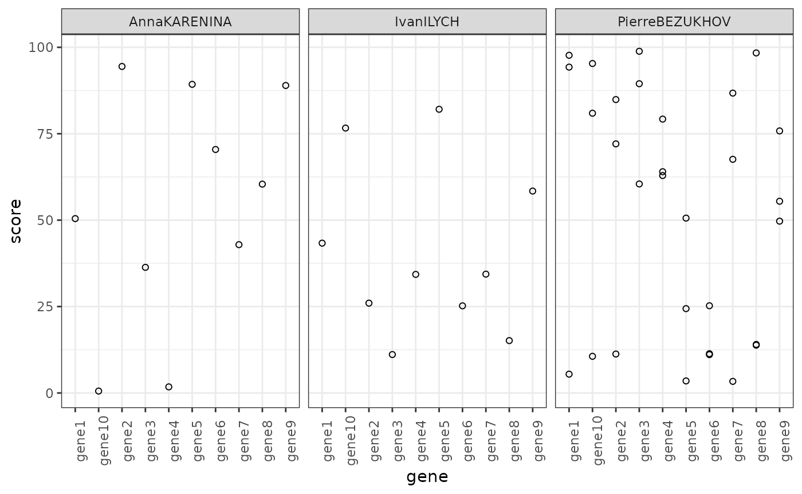

# Reading files with labno

``` r
library(labno)
library(readr)
library(purrr)
library(ggplot2)
```

I built `labno` in response to a common problem I face whilst doing my
job as a clinical scientist.

There are multiple files with genetic results in, and the sample
identifiers are only in the filenames.

``` r

files <- list.files(path = "data/",
           pattern = ".*.csv",
           full.names = TRUE)

files
#> [1] "data//WS123456_12345678a_PierreBEZUKHOV.csv"
#> [2] "data//WS123456_12345678b_PierreBEZUKHOV.csv"
#> [3] "data//WS123456_12345678c_PierreBEZUKHOV.csv"
#> [4] "data//WS123456_23456789_AnnaKARENINA.csv"   
#> [5] "data//WS123456_34567890_IvanILYCH.csv"
```

Each file consists of results for different genes.

For the purpose of this example, I have randomly generated a “score” for
each gene. This is not real clinical data.

    #> # A tibble: 10 × 2
    #>    gene   score
    #>    <chr>  <dbl>
    #>  1 gene1  97.7 
    #>  2 gene2  11.3 
    #>  3 gene3  98.9 
    #>  4 gene4  64.0 
    #>  5 gene5   3.49
    #>  6 gene6  11.4 
    #>  7 gene7  86.8 
    #>  8 gene8  13.8 
    #>  9 gene9  49.7 
    #> 10 gene10 10.6

I want to get all the results into one dataframe, along with all the
relevant identifiers.

I can do this by creating a simple function which combines `read_csv`
from `readr` with the `mutate_ids` function from `labno`.

``` r

read_csv_with_ids <- function(file) {
  
  output <- read_csv(file,
                     show_col_types = FALSE) |> 
    mutate_ids(file)
  
  return(output)
  
}
```

Using `map` from `purrr` I can then iterate this function over the file
list and bind the data together.

``` r

all_data <- files |> 
  map(\(files) read_csv_with_ids(files)) |> 
  list_rbind()
```

This gives me the data in a single dataframe with each row annotated
with the correct sample identifiers.

| gene   |      score | labno    | worksheet | suffix | name           | labno_suffix | labno_suffix_worksheet |
|:-------|-----------:|:---------|:----------|:-------|:---------------|:-------------|:-----------------------|
| gene1  | 97.6955141 | 12345678 | WS123456  | a      | PierreBEZUKHOV | 12345678a    | 12345678a_WS123456     |
| gene2  | 11.2687355 | 12345678 | WS123456  | a      | PierreBEZUKHOV | 12345678a    | 12345678a_WS123456     |
| gene3  | 98.8593290 | 12345678 | WS123456  | a      | PierreBEZUKHOV | 12345678a    | 12345678a_WS123456     |
| gene4  | 64.0114902 | 12345678 | WS123456  | a      | PierreBEZUKHOV | 12345678a    | 12345678a_WS123456     |
| gene5  |  3.4885046 | 12345678 | WS123456  | a      | PierreBEZUKHOV | 12345678a    | 12345678a_WS123456     |
| gene6  | 11.3642443 | 12345678 | WS123456  | a      | PierreBEZUKHOV | 12345678a    | 12345678a_WS123456     |
| gene7  | 86.7547998 | 12345678 | WS123456  | a      | PierreBEZUKHOV | 12345678a    | 12345678a_WS123456     |
| gene8  | 13.8269989 | 12345678 | WS123456  | a      | PierreBEZUKHOV | 12345678a    | 12345678a_WS123456     |
| gene9  | 49.7064066 | 12345678 | WS123456  | a      | PierreBEZUKHOV | 12345678a    | 12345678a_WS123456     |
| gene10 | 10.6104016 | 12345678 | WS123456  | a      | PierreBEZUKHOV | 12345678a    | 12345678a_WS123456     |
| gene1  |  5.4439993 | 12345678 | WS123456  | b      | PierreBEZUKHOV | 12345678b    | 12345678b_WS123456     |
| gene2  | 72.0719737 | 12345678 | WS123456  | b      | PierreBEZUKHOV | 12345678b    | 12345678b_WS123456     |
| gene3  | 60.4684200 | 12345678 | WS123456  | b      | PierreBEZUKHOV | 12345678b    | 12345678b_WS123456     |
| gene4  | 79.2336205 | 12345678 | WS123456  | b      | PierreBEZUKHOV | 12345678b    | 12345678b_WS123456     |
| gene5  | 24.4005622 | 12345678 | WS123456  | b      | PierreBEZUKHOV | 12345678b    | 12345678b_WS123456     |
| gene6  | 11.0944414 | 12345678 | WS123456  | b      | PierreBEZUKHOV | 12345678b    | 12345678b_WS123456     |
| gene7  |  3.3582193 | 12345678 | WS123456  | b      | PierreBEZUKHOV | 12345678b    | 12345678b_WS123456     |
| gene8  | 98.3774984 | 12345678 | WS123456  | b      | PierreBEZUKHOV | 12345678b    | 12345678b_WS123456     |
| gene9  | 55.4686784 | 12345678 | WS123456  | b      | PierreBEZUKHOV | 12345678b    | 12345678b_WS123456     |
| gene10 | 80.9327019 | 12345678 | WS123456  | b      | PierreBEZUKHOV | 12345678b    | 12345678b_WS123456     |
| gene1  | 94.2702363 | 12345678 | WS123456  | c      | PierreBEZUKHOV | 12345678c    | 12345678c_WS123456     |
| gene2  | 84.8811300 | 12345678 | WS123456  | c      | PierreBEZUKHOV | 12345678c    | 12345678c_WS123456     |
| gene3  | 89.4712796 | 12345678 | WS123456  | c      | PierreBEZUKHOV | 12345678c    | 12345678c_WS123456     |
| gene4  | 62.9010040 | 12345678 | WS123456  | c      | PierreBEZUKHOV | 12345678c    | 12345678c_WS123456     |
| gene5  | 50.5924463 | 12345678 | WS123456  | c      | PierreBEZUKHOV | 12345678c    | 12345678c_WS123456     |
| gene6  | 25.2354199 | 12345678 | WS123456  | c      | PierreBEZUKHOV | 12345678c    | 12345678c_WS123456     |
| gene7  | 67.6015973 | 12345678 | WS123456  | c      | PierreBEZUKHOV | 12345678c    | 12345678c_WS123456     |
| gene8  | 14.0432803 | 12345678 | WS123456  | c      | PierreBEZUKHOV | 12345678c    | 12345678c_WS123456     |
| gene9  | 75.8114634 | 12345678 | WS123456  | c      | PierreBEZUKHOV | 12345678c    | 12345678c_WS123456     |
| gene10 | 95.3160182 | 12345678 | WS123456  | c      | PierreBEZUKHOV | 12345678c    | 12345678c_WS123456     |
| gene1  | 50.4452151 | 23456789 | WS123456  |        | AnnaKARENINA   | 23456789     | 23456789_WS123456      |
| gene2  | 94.4651708 | 23456789 | WS123456  |        | AnnaKARENINA   | 23456789     | 23456789_WS123456      |
| gene3  | 36.3450093 | 23456789 | WS123456  |        | AnnaKARENINA   | 23456789     | 23456789_WS123456      |
| gene4  |  1.7642395 | 23456789 | WS123456  |        | AnnaKARENINA   | 23456789     | 23456789_WS123456      |
| gene5  | 89.2965208 | 23456789 | WS123456  |        | AnnaKARENINA   | 23456789     | 23456789_WS123456      |
| gene6  | 70.4437311 | 23456789 | WS123456  |        | AnnaKARENINA   | 23456789     | 23456789_WS123456      |
| gene7  | 42.9037774 | 23456789 | WS123456  |        | AnnaKARENINA   | 23456789     | 23456789_WS123456      |
| gene8  | 60.4224573 | 23456789 | WS123456  |        | AnnaKARENINA   | 23456789     | 23456789_WS123456      |
| gene9  | 88.9575026 | 23456789 | WS123456  |        | AnnaKARENINA   | 23456789     | 23456789_WS123456      |
| gene10 |  0.5565599 | 23456789 | WS123456  |        | AnnaKARENINA   | 23456789     | 23456789_WS123456      |
| gene1  | 43.3481782 | 34567890 | WS123456  |        | IvanILYCH      | 34567890     | 34567890_WS123456      |
| gene2  | 25.9921850 | 34567890 | WS123456  |        | IvanILYCH      | 34567890     | 34567890_WS123456      |
| gene3  | 11.1211967 | 34567890 | WS123456  |        | IvanILYCH      | 34567890     | 34567890_WS123456      |
| gene4  | 34.3106907 | 34567890 | WS123456  |        | IvanILYCH      | 34567890     | 34567890_WS123456      |
| gene5  | 82.0752608 | 34567890 | WS123456  |        | IvanILYCH      | 34567890     | 34567890_WS123456      |
| gene6  | 25.2085669 | 34567890 | WS123456  |        | IvanILYCH      | 34567890     | 34567890_WS123456      |
| gene7  | 34.3805890 | 34567890 | WS123456  |        | IvanILYCH      | 34567890     | 34567890_WS123456      |
| gene8  | 15.1524318 | 34567890 | WS123456  |        | IvanILYCH      | 34567890     | 34567890_WS123456      |
| gene9  | 58.4151974 | 34567890 | WS123456  |        | IvanILYCH      | 34567890     | 34567890_WS123456      |
| gene10 | 76.6390498 | 34567890 | WS123456  |        | IvanILYCH      | 34567890     | 34567890_WS123456      |

Then I can explore this collated data using `ggplot2`.


